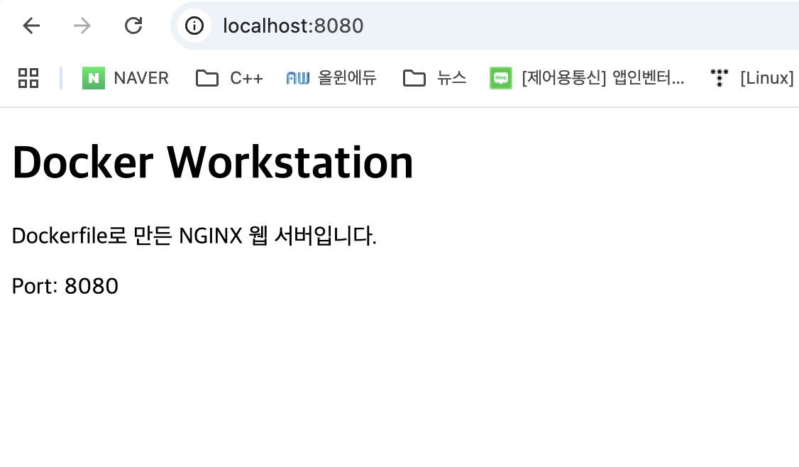
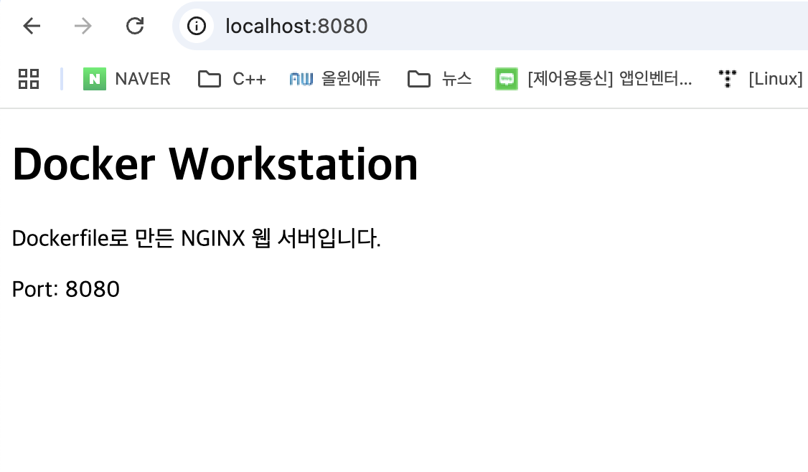

# 개발 워크스테이션 구축

## 1. 프로젝트 개요

이 프로젝트는 macOS 환경에서 터미널, Docker, Git/GitHub를 활용하여 재현 가능한 개발 워크스테이션을 구축하는 것을 목표로 한다.

OrbStack을 통해 Docker 실행 환경을 구성하고, Dockerfile 기반 웹 서버 실행, 포트 매핑, 바인드 마운트, 볼륨 영속성을 단계별로 검증한다. 모든 수행 명령과 핵심 결과는 이 문서에서 확인할 수 있도록 정리한다.

## 2. 실행 환경

| 항목 | 환경 |
| --- | --- |
| 운영체제 | macOS 15.7.7 |
| 빌드 버전 | 24G720 |
| CPU 아키텍처 | Intel x86_64 |
| Shell | zsh (`/bin/zsh`) |
| Git | 2.53.0 |
| Docker Client | 28.5.2 |
| Docker Server | 28.5.2 |
| Docker Context | OrbStack |
| Docker Compose | 2.40.3 |
| Docker Buildx | 0.29.1 |

## 3. 수행 항목 체크리스트

- [x] macOS, CPU 아키텍처 및 Shell 확인
- [x] Git 설치 및 버전 확인
- [x] OrbStack 실행 및 Docker 버전 확인
- [x] Docker Client와 Server 연결 확인
- [x] 터미널 파일 및 디렉터리 조작
- [x] 파일 및 디렉터리 권한 변경
- [x] Docker 이미지 다운로드 및 목록 확인
- [x] Docker 컨테이너 실행·중지·재시작
- [x] `hello-world` 컨테이너 실행
- [x] Ubuntu 컨테이너 실행 및 내부 명령 수행
- [x] Docker 로그 및 리소스 사용량 확인
- [x] `docker exec`와 `docker attach` 차이 확인
- [x] Dockerfile 기반 커스텀 웹 서버 이미지 제작
- [x] 포트 매핑 및 웹 브라우저 접속 확인
- [x] 바인드 마운트 변경 반영 검증
- [x] Docker 볼륨 영속성 검증
- [x] 트러블슈팅 2건 이상 정리

## 4. 개발 환경 확인

### 4.1 macOS 버전 확인

실행 명령:

```bash
sw_vers
```

실행 결과:

```text
ProductName:        macOS
ProductVersion:     15.7.7
BuildVersion:       24G720
```

### 4.2 CPU 아키텍처 확인

실행 명령:

```bash
uname -m
```

실행 결과:

```text
x86_64
```

현재 실습 환경은 Apple Silicon이 아닌 Intel 기반 Mac이다.

### 4.3 Shell 확인

실행 명령:

```bash
echo $SHELL
```

실행 결과:

```text
/bin/zsh
```

### 4.4 Git 버전 확인

실행 명령:

```bash
git --version
```

실행 결과:

```text
git version 2.53.0
```

### 4.5 Docker 버전 확인

실행 명령:

```bash
docker --version
```

실행 결과:

```text
Docker version 28.5.2, build ecc6942
```

### 4.6 Docker 엔진 동작 확인

실행 명령:

```bash
docker info
```

핵심 실행 결과:

```text
Client:
 Version:    28.5.2
 Context:    orbstack
 Debug Mode: false

Server:
 Containers: 0
  Running: 0
  Paused: 0
  Stopped: 0
 Images: 0
 Server Version: 28.5.2
 Storage Driver: overlay2
  Backing Filesystem: btrfs
 Logging Driver: json-file
 Cgroup Driver: cgroupfs
 Cgroup Version: 2
 Runtimes: io.containerd.runc.v2 runc
 Default Runtime: runc
```

`docker info`에서 Client와 Server 정보가 모두 출력되었으며, Docker Context가 `orbstack`으로 설정된 것을 확인했다.

따라서 OrbStack 내부 Docker 엔진과 Docker CLI가 정상적으로 연결된 상태이다.

초기 점검 당시 이미지와 컨테이너가 각각 0개인 초기 환경이었다.

## 5. 터미널 기본 조작

### 5.1 현재 위치 및 파일 목록 확인

실행 명령:

```bash
pwd
ls -la
```

실행 결과:

```text
/Users/[USER]/Codyssey/project1/terminal-lab

total 0
drwxr-xr-x  2 [USER]  [USER]   64  7 30 14:33 .
drwxr-xr-x  9 [USER]  [USER]  288  7 30 12:19 ..
```

`pwd`를 통해 현재 작업 위치를 확인하고, `ls -la`를 통해 숨김 파일을 포함한 전체 목록을 확인했다.

절대 경로는 파일 시스템의 루트부터 시작하는 전체 경로이며, 상대 경로는 현재 작업 위치를 기준으로 표시하는 경로이다.

```text
절대 경로: /Users/[USER]/Codyssey/project1/terminal-lab
상대 경로: terminal-lab
```

### 5.2 파일 생성 및 내용 확인

실행 명령:

```bash
touch empty.txt
echo "Docker Practice" > note.txt
ls -la
cat note.txt
```

실행 결과:

```text
-rw-r--r--  1 [USER]  [USER]   0  7 30 14:33 empty.txt
-rw-r--r--  1 [USER]  [USER]  16  7 30 14:33 note.txt

Docker Practice
```

`touch`를 사용하여 내용이 없는 `empty.txt` 파일을 생성했다.

`echo`와 출력 리다이렉션 기호 `>`를 사용하여 `note.txt`에 문자열을 저장하고, `cat`을 사용하여 파일 내용을 확인했다.

### 5.3 파일 복사

실행 명령:

```bash
cp note.txt copy-note.txt
ls -la
```

실행 결과:

```text
-rw-r--r--  1 [USER]  [USER]  16  7 30 14:34 copy-note.txt
-rw-r--r--  1 [USER]  [USER]   0  7 30 14:33 empty.txt
-rw-r--r--  1 [USER]  [USER]  16  7 30 14:33 note.txt
```

`cp`를 사용하여 `note.txt`를 `copy-note.txt`라는 새로운 파일로 복사했다.

### 5.4 파일 이름 변경

실행 명령:

```bash
mv copy-note.txt renamed-note.txt
ls -la
```

실행 결과:

```text
-rw-r--r--  1 [USER]  [USER]   0  7 30 14:33 empty.txt
-rw-r--r--  1 [USER]  [USER]  16  7 30 14:33 note.txt
-rw-r--r--  1 [USER]  [USER]  16  7 30 14:34 renamed-note.txt
```

`mv`를 사용하여 `copy-note.txt`의 이름을 `renamed-note.txt`로 변경했다.

### 5.5 디렉터리 생성 및 파일 이동

실행 명령:

```bash
mkdir archive
mv renamed-note.txt archive
ls -la archive
```

실행 결과:

```text
total 8
drwxr-xr-x  3 [USER]  [USER]  96  7 30 14:34 .
drwxr-xr-x  5 [USER]  [USER] 160  7 30 14:34 ..
-rw-r--r--  1 [USER]  [USER]  16  7 30 14:34 renamed-note.txt
```

`mkdir`로 `archive` 디렉터리를 생성한 후, `mv`를 사용하여 `renamed-note.txt`를 해당 디렉터리로 이동했다.

### 5.6 파일 및 디렉터리 삭제

실행 명령:

```bash
rm archive/renamed-note.txt
rmdir archive
ls
```

실행 결과:

```text
empty.txt
note.txt
```

`rm`을 사용하여 파일을 삭제하고, `rmdir`을 사용하여 비어 있는 `archive` 디렉터리를 삭제했다.

`rmdir`은 비어 있는 디렉터리만 삭제할 수 있다.

## 6. 파일 및 디렉터리 권한 실습

### 6.1 권한 실습 대상 생성

실행 명령:

```bash
touch permission-lab/ex.txt
mkdir permission-lab/ex-directory
```

파일과 디렉터리의 권한 차이를 확인하기 위해 `ex.txt` 파일과 `ex-directory` 디렉터리를 생성했다.

### 6.2 제한된 권한 설정

실행 명령:

```bash
chmod 600 permission-lab/ex.txt
chmod 700 permission-lab/ex-directory

ls -ld permission-lab/ex.txt
ls -ld permission-lab/ex-directory

stat -f "%Sp %OLp %N" permission-lab/ex.txt
stat -f "%Sp %OLp %N" permission-lab/ex-directory
```

실행 결과:

```text
-rw-------  1 [USER]  [USER]  0  7 30 14:35 permission-lab/ex.txt
drwx------  2 [USER]  [USER] 64  7 30 14:36 permission-lab/ex-directory

-rw------- 600 permission-lab/ex.txt
drwx------ 700 permission-lab/ex-directory
```

`ex.txt`에는 `600`, `ex-directory`에는 `700` 권한을 설정했다.

- `600`: 소유자만 파일을 읽고 수정할 수 있다.
- `700`: 소유자만 디렉터리를 읽고 수정하고 접근할 수 있다.

### 6.3 일반적인 파일 및 디렉터리 권한 설정

실행 명령:

```bash
chmod 644 permission-lab/ex.txt
chmod 755 permission-lab/ex-directory

ls -ld permission-lab/ex.txt
ls -ld permission-lab/ex-directory
```

실행 결과:

```text
-rw-r--r--  1 [USER]  [USER]  0  7 30 14:35 permission-lab/ex.txt
drwxr-xr-x  2 [USER]  [USER] 64  7 30 14:36 permission-lab/ex-directory
```

파일에는 일반적으로 사용하는 `644`, 디렉터리에는 `755` 권한을 설정했다.

### 6.4 권한 숫자와 문자 표기 해석

권한 숫자는 다음 값을 더하여 계산한다.

| 권한 | 숫자 | 의미 |
| --- | ---: | --- |
| `r` | 4 | 읽기 |
| `w` | 2 | 쓰기 |
| `x` | 1 | 실행 또는 디렉터리 접근 |
| `-` | 0 | 해당 권한 없음 |

권한은 다음 순서로 표시된다.

```text
소유자(User) → 그룹(Group) → 기타 사용자(Others)
```

숫자 권한도 동일한 순서를 사용한다.

| 숫자 위치 | 대상 | 의미 |
| --- | --- | --- |
| 첫 번째 숫자 | 소유자 | 파일 소유자의 권한 |
| 두 번째 숫자 | 그룹 | 소유 그룹의 권한 |
| 세 번째 숫자 | 기타 사용자 | 나머지 사용자의 권한 |

`644`는 다음과 같이 계산한다.

| 대상 | 계산 | 문자 권한 | 의미 |
| --- | --- | --- | --- |
| 소유자 | 4 + 2 = 6 | `rw-` | 읽기·쓰기 |
| 그룹 | 4 | `r--` | 읽기 |
| 기타 사용자 | 4 | `r--` | 읽기 |

문자 표기에서는 첫 번째 문자가 파일 종류를 의미하고, 이후 아홉 글자는 세 글자씩 나누어 해석한다.

| 구간 | 예시 | 의미 |
| --- | --- | --- |
| 첫 번째 문자 | `-` | 일반 파일 |
| 첫 번째 권한 묶음 | `rw-` | 소유자 권한 |
| 두 번째 권한 묶음 | `r--` | 그룹 권한 |
| 세 번째 권한 묶음 | `r--` | 기타 사용자 권한 |

파일 종류 표기는 다음과 같다.

| 문자 | 의미 |
| --- | --- |
| `-` | 일반 파일 |
| `d` | 디렉터리 |
| `l` | 심볼릭 링크 |

`644` 파일 권한은 다음과 같다.

```text
-rw-r--r--
```

| 대상 | 문자 권한 | 숫자 | 설명 |
| --- | --- | ---: | --- |
| 소유자 | `rw-` | 6 | 읽기·쓰기 가능 |
| 그룹 | `r--` | 4 | 읽기만 가능 |
| 기타 사용자 | `r--` | 4 | 읽기만 가능 |

`755` 디렉터리 권한은 다음과 같다.

```text
drwxr-xr-x
```

| 대상 | 문자 권한 | 숫자 | 설명 |
| --- | --- | ---: | --- |
| 소유자 | `rwx` | 7 | 읽기·쓰기·접근 가능 |
| 그룹 | `r-x` | 5 | 읽기·접근 가능 |
| 기타 사용자 | `r-x` | 5 | 읽기·접근 가능 |

파일과 디렉터리에서 각 권한의 동작은 다음과 같다.

| 대상 | `r` | `w` | `x` |
| --- | --- | --- | --- |
| 파일 | 내용 읽기 | 내용 수정 | 파일 실행 |
| 디렉터리 | 내부 파일 이름 확인 | 내부 파일 생성·삭제 | 디렉터리 진입 및 내부 항목 접근 |

## 7. 트러블슈팅

[트러블슈팅 보기](docs/trouble_shooting.md)

## 8. Docker 기본 운영 및 컨테이너 실습

### 8.1 hello-world 이미지 다운로드

실행 명령:

```bash
docker pull hello-world
```

실행 결과:

```text
Using default tag: latest
latest: Pulling from library/hello-world
Digest: sha256:c3cbe1cc1aa588a64951ac6286e0df7b27fe2e6324b1001c619bb358770c0178
Status: Image is up to date for hello-world:latest
docker.io/library/hello-world:latest
```

태그를 지정하지 않았기 때문에 기본 태그인 `latest`가 사용되었다.

다운로드한 이미지를 확인했다.

```bash
docker images
```

```text
REPOSITORY    TAG       IMAGE ID       CREATED        SIZE
hello-world   latest    e2ac70e7319a   4 months ago   10.1kB
```

### 8.2 hello-world 컨테이너 실행

실행 명령:

```bash
docker run --name hello-lab hello-world
```

핵심 실행 결과:

```text
Hello from Docker!
This message shows that your installation appears to be working correctly.
```

명령에서 사용한 이미지와 컨테이너 이름은 다음과 같다.

| 항목 | 값 | 의미 |
| --- | --- | --- |
| 이미지 | `hello-world` | 컨테이너 생성에 사용한 이미지 |
| 컨테이너 | `hello-lab` | `--name`으로 지정한 컨테이너 이름 |

`hello-world`는 메시지를 출력한 후 즉시 종료되는 컨테이너이다.

### 8.3 실행 및 종료 상태 확인

실행 명령:

```bash
docker ps
```

실행 결과:

```text
CONTAINER ID   IMAGE   COMMAND   CREATED   STATUS   PORTS   NAMES
```

실행 명령:

```bash
docker ps -a
```

실행 결과:

```text
CONTAINER ID   IMAGE         COMMAND    STATUS                    NAMES
55e58ca70c68   hello-world   "/hello"   Exited (0) 23 seconds ago hello-lab
```

`docker ps`에는 실행 중인 컨테이너만 표시되므로 이미 종료된 `hello-lab`은 나타나지 않았다.

`docker ps -a`에서는 종료된 컨테이너까지 표시되며, `hello-lab`이 종료 코드 `0`으로 정상 종료된 것을 확인했다.

### 8.4 컨테이너 로그 확인

실행 명령:

```bash
docker logs hello-lab
```

핵심 실행 결과:

```text
Hello from Docker!
This message shows that your installation appears to be working correctly.
```

컨테이너가 종료된 후에도 `docker logs`를 사용하여 컨테이너가 출력한 내용을 확인할 수 있었다.

### 8.5 Ubuntu 컨테이너 실행

실행 명령:

```bash
docker run -dit \
  --name ubuntu-lab \
  ubuntu:24.04 \
  sleep infinity
```

실행 결과:

```text
7ab8decd9aba860f57293a381822a23db0e04641d231f1e4a76366bc3b8f9cf9
```

사용한 옵션은 다음과 같다.

| 옵션 및 인자 | 의미 |
| --- | --- |
| `-d` | 백그라운드에서 실행 |
| `-i` | 표준 입력을 열린 상태로 유지 |
| `-t` | 가상 터미널 할당 |
| `--name ubuntu-lab` | 컨테이너 이름 지정 |
| `ubuntu:24.04` | 사용할 이미지와 태그 |
| `sleep infinity` | 메인 프로세스를 계속 실행하여 컨테이너 유지 |

실행 상태를 확인했다.

```bash
docker ps
```

```text
CONTAINER ID   IMAGE          COMMAND            STATUS          NAMES
7ab8decd9aba   ubuntu:24.04   "sleep infinity"   Up 17 seconds   ubuntu-lab
```

### 8.6 Docker 이미지 목록 확인

실행 명령:

```bash
docker images
```

실행 결과:

```text
REPOSITORY    TAG       IMAGE ID       CREATED        SIZE
ubuntu        latest    de7345b16e94   2 weeks ago    100MB
ubuntu        24.04     ef91e4b15da8   5 weeks ago    78.1MB
hello-world   latest    e2ac70e7319a   4 months ago   10.1kB
```

`ubuntu:latest`와 `ubuntu:24.04`는 저장소 이름은 같지만 태그와 이미지 ID가 다른 이미지이다.

이번 실습에서는 버전을 명확하게 지정한 `ubuntu:24.04` 이미지를 사용했다.

### 8.7 Ubuntu 컨테이너 내부 진입

실행 명령:

```bash
docker exec -it ubuntu-lab bash
```

컨테이너 내부에서 다음 명령을 실행했다.

```bash
pwd
ls -la
echo "Hello Worllllddddd"
cat etc/os-release
```

핵심 실행 결과:

```text
/
Hello Worllllddddd

PRETTY_NAME="Ubuntu 24.04.4 LTS"
NAME="Ubuntu"
VERSION_ID="24.04"
VERSION="24.04.4 LTS (Noble Numbat)"
VERSION_CODENAME=noble
ID=ubuntu
ID_LIKE=debian
```

현재 작업 위치가 루트 디렉터리 `/`였기 때문에 상대 경로 `etc/os-release`는 절대 경로 `/etc/os-release`와 같은 파일을 가리킨다.

컨테이너 내부에서 다음 명령으로 나왔다.

```bash
exit
```

Mac에서 다시 컨테이너 상태를 확인했다.

```bash
docker ps
```

```text
CONTAINER ID   IMAGE          COMMAND            STATUS         NAMES
7ab8decd9aba   ubuntu:24.04   "sleep infinity"   Up 3 minutes   ubuntu-lab
```

`docker exec`로 실행한 Bash를 종료했지만 컨테이너의 메인 프로세스인 `sleep infinity`는 계속 실행 중이기 때문에 컨테이너가 유지되었다.

### 8.8 컨테이너 리소스 사용량 확인

실행 명령:

```bash
docker stats --no-stream ubuntu-lab
```

실행 결과:

```text
CONTAINER ID   NAME         CPU %   MEM USAGE / LIMIT   MEM %   NET I/O         BLOCK I/O         PIDS
7ab8decd9aba   ubuntu-lab   0.00%   872KiB / 15.67GiB   0.01%   1.13kB / 126B   8.34MB / 8.19kB   1
```

`docker stats`로 CPU, 메모리, 네트워크, 디스크 입출력 및 프로세스 사용량을 확인했다.

`--no-stream` 옵션을 사용하여 실시간 갱신 없이 현재 상태를 한 번만 출력했다.

### 8.9 컨테이너 중지 및 재시작

컨테이너를 중지했다.

```bash
docker stop ubuntu-lab
docker ps
docker ps -a --filter name=ubuntu-lab
```

실행 결과:

```text
ubuntu-lab

CONTAINER ID   IMAGE          COMMAND            STATUS                         NAMES
7ab8decd9aba   ubuntu:24.04   "sleep infinity"   Exited (137) 20 seconds ago    ubuntu-lab
```

`docker ps`에서는 컨테이너가 표시되지 않았고, `docker ps -a`에서 종료 상태를 확인했다.

다시 컨테이너를 시작했다.

```bash
docker start ubuntu-lab
docker ps
```

실행 결과:

```text
ubuntu-lab

CONTAINER ID   IMAGE          COMMAND            STATUS         NAMES
7ab8decd9aba   ubuntu:24.04   "sleep infinity"   Up 2 seconds   ubuntu-lab
```

기존 컨테이너를 삭제하거나 새로 생성하지 않고 다시 실행할 수 있음을 확인했다.

### 8.10 exec와 attach 차이 확인

[차이 확인하기](docs/diff_exec_attach.md)

### 8.11 이미지와 컨테이너의 차이

이미지는 컨테이너 실행에 필요한 파일과 설정을 포함한 읽기 전용 템플릿이다.

컨테이너는 이미지를 기반으로 생성된 실제 실행 환경이다.

하나의 이미지로 여러 개의 서로 다른 컨테이너를 생성할 수 있다.

| 구분 | 예시 |
| --- | --- |
| 이미지 | `ubuntu:24.04` |
| 이미지로 생성한 컨테이너 | `ubuntu-lab`, `ubuntu-attach` |

## 9. Dockerfile 기반 커스텀 이미지 제작

### 9.1 웹 서버 파일 작성

`app/index.html`에 다음과 같은 정적 웹 페이지를 작성했다.

```html
<!DOCTYPE html>
<html lang="ko">
<head>
    <meta charset="UTF-8">
    <meta name="viewport" content="width=device-width, initial-scale=1.0">
    <title>Docker Workstation</title>
</head>
<body>
    <h1>Docker Workstation</h1>
    <p>Dockerfile로 만든 NGINX 웹 서버입니다.</p>
    <p>Port: 8080</p>
</body>
</html>
```

작성된 파일을 확인했다.

```bash
cat app/index.html
```

### 9.2 Dockerfile 작성

다음과 같이 Dockerfile을 직접 작성했다.

```dockerfile
FROM nginx:1.28-alpine

COPY app/index.html /usr/share/nginx/html/index.html

EXPOSE 80
```

각 명령의 의미는 다음과 같다.

| 명령 | 의미 |
| --- | --- |
| `FROM` | 커스텀 이미지의 기반이 되는 베이스 이미지 지정 |
| `COPY` | 호스트의 HTML 파일을 이미지 내부로 복사 |
| `EXPOSE` | 컨테이너가 사용할 포트를 문서화 |

베이스 이미지로 `nginx:1.28-alpine`을 선택했다.

NGINX가 이미 설치되어 있어 별도로 웹 서버를 설치할 필요가 없고, Alpine Linux 기반이므로 비교적 작은 이미지로 웹 서버를 구성할 수 있다.

적용한 커스텀 요소는 직접 작성한 `app/index.html`을 NGINX의 기본 웹 문서 경로에 복사한 것이다.

`EXPOSE 80`은 컨테이너가 80번 포트를 사용한다는 정보를 나타낼 뿐, 호스트와 포트를 실제로 연결하지는 않는다. 포트 연결은 컨테이너 실행 시 `-p` 옵션으로 설정한다.

### 9.3 커스텀 이미지 빌드

실행 명령:

```bash
docker build -t project1:1.0 .
```

핵심 실행 결과:

```text
[+] Building 6.6s (7/7) FINISHED
 => [internal] load build definition from Dockerfile
 => [internal] load metadata for docker.io/library/nginx:1.28-alpine
 => [1/2] FROM docker.io/library/nginx:1.28-alpine
 => [2/2] COPY app/index.html /usr/share/nginx/html/index.html
 => exporting to image
 => => writing image sha256:d7120054f327...
 => => naming to docker.io/library/project1:1.0
```

Dockerfile의 두 단계가 정상적으로 수행된 것을 확인했다.

1. `nginx:1.28-alpine` 베이스 이미지 준비
2. `app/index.html`을 이미지 내부에 복사

### 9.4 빌드된 이미지 확인

실행 명령:

```bash
docker images
```

실행 결과:

```text
REPOSITORY    TAG       IMAGE ID       CREATED          SIZE
project1      1.0       d7120054f327   18 seconds ago   62.1MB
ubuntu        latest    de7345b16e94   2 weeks ago      100MB
ubuntu        24.04     ef91e4b15da8   5 weeks ago      78.1MB
hello-world   latest    e2ac70e7319a   4 months ago     10.1kB
```

`project1:1.0` 커스텀 이미지가 정상적으로 생성된 것을 확인했다.

이미지에 포함된 HTML은 `docker build`를 실행한 시점의 파일이다. 이후 호스트의 `app/index.html`을 수정해도 이미 생성된 이미지 내부의 파일은 자동으로 변경되지 않는다.

## 10. 포트 매핑 및 웹 서버 접속

### 10.1 웹 서버 컨테이너 실행

실행 명령:

```bash
docker run -d \
  --name project \
  -p 8080:80 \
  project1:1.0
```

실행 결과:

```text
901a6d01205e21bf4e7f0033e8776fe5e5e7ab7473877142a2ea6acc46f8a7e8
```

사용한 옵션은 다음과 같다.

| 옵션 및 인자 | 의미 |
| --- | --- |
| `-d` | 컨테이너를 백그라운드에서 실행 |
| `--name project` | 컨테이너 이름 지정 |
| `-p 8080:80` | 호스트의 8080번 포트를 컨테이너의 80번 포트에 연결 |
| `project1:1.0` | 컨테이너 생성에 사용할 이미지 |

### 10.2 컨테이너와 포트 확인

실행 명령:

```bash
docker ps
```

실행 결과:

```text
CONTAINER ID   IMAGE          STATUS       PORTS                                     NAMES
901a6d01205e   project1:1.0   Up 4 seconds 0.0.0.0:8080->80/tcp, [::]:8080->80/tcp  project
```

포트 매핑을 별도로 확인했다.

```bash
docker port project
```

```text
80/tcp -> 0.0.0.0:8080
80/tcp -> [::]:8080
```

컨테이너 내부의 80번 포트가 호스트의 8080번 포트와 연결된 것을 확인했다.

### 10.3 curl 접속 확인

실행 명령:

```bash
curl http://localhost:8080
```

실행 결과:

```html
<!DOCTYPE html>
<html lang="ko">
<head>
    <meta charset="UTF-8">
    <meta name="viewport" content="width=device-width, initial-scale=1.0">
    <title>Docker Workstation</title>
</head>
<body>
    <h1>Docker Workstation</h1>
    <p>Dockerfile로 만든 NGINX 웹 서버입니다.</p>
    <p>Port: 8080</p>
</body>
</html>
```

직접 작성한 HTML이 정상적으로 반환된 것을 확인했다.

### 10.4 NGINX 로그 확인

실행 명령:

```bash
docker logs project
```

핵심 실행 결과:

```text
Configuration complete; ready for start up
nginx/1.28.3
"GET / HTTP/1.1" 200 323 "-" "curl/8.7.1"
```

HTTP 상태 코드 `200`이 기록되어 요청이 정상적으로 처리된 것을 확인했다.

### 10.5 브라우저 접속 증거

브라우저에서 다음 주소로 접속하여 웹 페이지가 정상적으로 표시되는 것을 확인했다.

```text
http://localhost:8080
```



## 11. 마운트 종류 및 바인드 마운트 검증

### 11.1 Docker 마운트가 필요한 이유

컨테이너 내부에서 생성한 데이터는 기본적으로 해당 컨테이너의 쓰기 가능 레이어에 저장된다. 컨테이너를 삭제하면 해당 데이터도 함께 삭제된다.

Docker에서는 데이터를 컨테이너 외부에 저장하거나 호스트와 공유하기 위해 마운트를 사용한다.

Docker에서 주로 사용하는 마운트 종류는 다음과 같다.

| 마운트 종류 | 저장 위치 | 컨테이너 삭제 후 데이터 | 주요 용도 |
| --- | --- | --- | --- |
| Bind mount | 사용자가 지정한 호스트 경로 | 호스트에 유지 | 소스코드·설정 파일 공유 |
| Volume mount | Docker가 관리하는 저장 공간 | 볼륨을 삭제하지 않으면 유지 | DB·영속 데이터 |
| tmpfs mount | 호스트 메모리 | 유지되지 않음 | 임시 데이터·캐시 |
| Named pipe | Windows Named Pipe | 사용 방식에 따라 다름 | Windows 프로세스 통신 |

현재 macOS와 OrbStack 환경에서 과제와 직접 관련된 마운트는 Bind mount와 Volume mount이다.

### 11.2 Bind mount

Bind mount는 호스트의 파일이나 디렉터리를 컨테이너의 특정 경로에 직접 연결한다.

```bash
--mount "type=bind,source=호스트경로,target=컨테이너경로"
```

호스트 파일을 수정하면 컨테이너에서도 변경된 내용을 즉시 확인할 수 있으므로 개발 중인 소스코드나 설정 파일을 공유할 때 적합하다.

다만 호스트의 특정 디렉터리 구조에 의존하므로 다른 컴퓨터에서 동일한 경로가 존재하지 않으면 실행되지 않을 수 있다.

### 11.3 Volume mount

Volume mount는 Docker가 저장 위치를 직접 관리한다.

```bash
docker volume create project-data
```

```bash
docker run \
  --mount type=volume,source=project-data,target=/data \
  IMAGE
```

사용자가 호스트의 실제 저장 경로를 직접 지정하지 않아도 되며, 컨테이너를 삭제해도 볼륨을 별도로 삭제하지 않는 한 데이터가 유지된다.

데이터베이스, 업로드 파일 및 애플리케이션 데이터처럼 장기간 유지해야 하는 데이터에 적합하다.

Volume은 다음 두 종류로 구분할 수 있다.

| 종류 | 설명 |
| --- | --- |
| Named volume | 사용자가 `project-data`와 같은 이름을 지정 |
| Anonymous volume | Docker가 임의의 이름을 생성 |

본 과제에서는 생성과 삭제 여부를 명확하게 확인하기 위해 Named volume을 사용한다.

### 11.4 마운트 종류 선택 기준

| 필요한 기능 | 적합한 마운트 |
| --- | --- |
| 호스트에서 파일을 직접 수정 | Bind mount |
| 컨테이너 삭제 후에도 데이터 유지 | Volume mount |
| 실행 중에만 필요한 임시 데이터 | tmpfs mount |
| Windows 프로세스 통신 | Named pipe |

간단히 정리하면 다음과 같다.

```text
호스트 파일과 직접 연결 → Bind mount
Docker가 영속 데이터를 관리 → Volume mount
메모리에 임시로 저장 → tmpfs mount
```

### 11.5 바인드 마운트 컨테이너 실행

호스트의 `app` 디렉터리를 컨테이너의 NGINX 웹 문서 경로에 연결했다.

실행 명령:

```bash
docker run -d \
  --name project-bind \
  -p 8081:80 \
  --mount "type=bind,source=$(pwd)/app,target=/usr/share/nginx/html,readonly" \
  project1:1.0
```

실행 결과:

```text
2b5935b24b1ff00544c31e897fc3ba05bb872c45c9fe497666f7540d2f6f6044
```

사용한 마운트 옵션은 다음과 같다.

| 옵션 | 설정값 | 의미 |
| --- | --- | --- |
| `type` | `bind` | 바인드 마운트 사용 |
| `source` | `$(pwd)/app` | 호스트에서 연결할 디렉터리 |
| `target` | `/usr/share/nginx/html` | 컨테이너에서 연결할 경로 |
| `readonly` | 설정됨 | 컨테이너에서 호스트 파일 수정 금지 |

이미지 기반 컨테이너와 바인드 마운트 컨테이너는 서로 다른 이름과 포트를 사용한다.

| 역할 | 컨테이너 | 호스트 포트 |
| --- | --- | ---: |
| 이미지에 복사된 HTML | `project-ori` | 8080 |
| 바인드 마운트 HTML | `project` | 8081 |

### 11.6 마운트 설정 확인

실행 명령:

```bash
docker inspect project-bind --format '{{json .Mounts}}'
```

실행 결과:

```text
[
  {
    "Type":"bind",
    "Source":"/Users/[USER]/Codyssey/project1/app",
    "Destination":"/usr/share/nginx/html",
    "Mode":"",
    "RW":false,
    "Propagation":"rprivate"
  }
]
```

마운트 설정에서 다음 내용을 확인했다.

| 항목 | 결과 |
| --- | --- |
| 마운트 종류 | `bind` |
| 호스트 경로 | `~/Codyssey/project1/app` |
| 컨테이너 경로 | `/usr/share/nginx/html` |
| 컨테이너 쓰기 가능 여부 | `false` |

`readonly` 옵션을 적용했기 때문에 컨테이너에서는 호스트 파일을 수정할 수 없지만, 호스트에서 수정한 내용은 컨테이너에 반영된다.

개인 사용자명이 포함된 호스트 경로는 `[USER]`로 마스킹했다.

### 11.7 변경 전 결과 비교

이미지 기반 컨테이너의 결과를 확인했다.

```bash
curl -s http://localhost:8080 | grep -E '<h1>|<p>'
```

```html
<h1>Docker Workstation</h1>
<p>Dockerfile로 만든 NGINX 웹 서버입니다.</p>
<p>Port: 8080</p>
```

바인드 마운트 컨테이너의 결과를 확인했다.

```bash
curl -s http://localhost:8081 | grep -E '<h1>|<p>'
```

```html
<h1>Docker Workstation</h1>
<p>Dockerfile로 작성한 NGINX 웹 서버입니다.</p>
<p>Port: 8080</p>
```

### 11.8 호스트 파일 변경

호스트에서 `app/index.html`의 내용을 수정했다.

```html
<h1>Docker Workstation</h1>
<p>Dockerfile로 수정한 NGINX 웹 서버입니다.</p>
<p>Port: 8081</p>
```

이미지를 다시 빌드하거나 컨테이너를 재시작하지 않고 8081번 포트의 응답을 다시 확인했다.

```bash
curl -s http://localhost:8081 | grep -E '<h1>|<p>'
```

```html
<h1>Docker Workstation</h1>
<p>Dockerfile로 수정한 NGINX 웹 서버입니다.</p>
<p>Port: 8081</p>
```

호스트의 `app/index.html`을 수정한 직후 바인드 마운트 컨테이너에 변경된 내용이 반영된 것을 확인했다.



### 11.9 이미지 복사 방식과 바인드 마운트 비교

| 구분 | 이미지 기반 컨테이너 | 바인드 마운트 컨테이너 |
| --- | --- | --- |
| 접속 포트 | 8080 | 8081 |
| HTML 위치 | 이미지 내부 | 호스트의 `app` 디렉터리 |
| 호스트 파일 수정 | 반영되지 않음 | 즉시 반영 |
| 변경 적용 방법 | 이미지 재빌드 및 컨테이너 재생성 | 별도 빌드 없이 자동 반영 |

Dockerfile의 `COPY`는 이미지 빌드 시점의 파일을 이미지 내부에 저장한다.

따라서 빌드 후 호스트 파일을 수정해도 기존 이미지와 해당 이미지로 생성된 컨테이너는 변경되지 않는다.

바인드 마운트는 호스트 디렉터리를 컨테이너 경로에 연결하므로 호스트 파일의 변경이 컨테이너에 즉시 반영된다.

마운트가 적용된 동안에는 이미지 내부의 기존 파일이 삭제되는 것이 아니라, 마운트된 호스트 파일에 의해 가려진다.

## 12. Docker 볼륨 영속성 검증

### 12.1 Docker 볼륨 생성

Named volume인 `project-data`를 생성했다.

실행 명령:

```bash
docker volume create project-data
```

실행 결과:

```text
project-data
```

생성된 볼륨 목록을 확인했다.

```bash
docker volume ls
```

```text
DRIVER    VOLUME NAME
local     project-data
```

### 12.2 볼륨 정보 확인

실행 명령:

```bash
docker volume inspect project-data
```

실행 결과:

```json
[
    {
        "CreatedAt": "2026-07-31T14:47:55+09:00",
        "Driver": "local",
        "Labels": null,
        "Mountpoint": "/var/lib/docker/volumes/project-data/_data",
        "Name": "project-data",
        "Options": null,
        "Scope": "local"
    }
]
```

볼륨 정보를 통해 다음 내용을 확인했다.

| 항목 | 결과 |
| --- | --- |
| 볼륨 이름 | `project-data` |
| 드라이버 | `local` |
| 범위 | `local` |
| Docker 내부 저장 경로 | `/var/lib/docker/volumes/project-data/_data` |

`Mountpoint`는 macOS의 일반 사용자 경로가 아니라 OrbStack 내부 Docker 엔진이 관리하는 Linux 파일 시스템의 경로이다.

Volume mount는 Bind mount와 달리 호스트 저장 경로를 사용자가 직접 지정하지 않는다. Docker가 실제 저장 위치를 관리한다.

### 12.3 볼륨을 연결한 컨테이너 실행

실행 명령:

```bash
docker run -d \
  --name project-volume \
  --mount type=volume,source=project-data,target=/data \
  ubuntu:24.04 \
  sleep infinity
```

실행 결과:

```text
a30f1d598566c63a350a24f9bd94e36f7a759a02c55439717eb8ac79c139e0d2
```

사용한 마운트 설정은 다음과 같다.

| 옵션 | 설정값 | 의미 |
| --- | --- | --- |
| `type` | `volume` | Volume mount 사용 |
| `source` | `project-data` | 사용할 Docker 볼륨 |
| `target` | `/data` | 컨테이너 내부 연결 경로 |

### 12.4 컨테이너의 마운트 설정 확인

실행 명령:

```bash
docker inspect project-volume --format '{{json .Mounts}}'
```

실행 결과:

```json
[
  {
    "Type":"volume",
    "Name":"project-data",
    "Source":"/var/lib/docker/volumes/project-data/_data",
    "Destination":"/data",
    "Driver":"local",
    "Mode":"z",
    "RW":true,
    "Propagation":""
  }
]
```

마운트 정보에서 다음 내용을 확인했다.

- 마운트 종류는 `volume`이다.
- `project-data` 볼륨이 사용되었다.
- 컨테이너의 `/data` 경로에 연결되었다.
- `RW`가 `true`이므로 컨테이너에서 데이터를 읽고 쓸 수 있다.

### 12.5 볼륨에 데이터 저장

실행 명령:

```bash
docker exec project-volume \
  sh -c 'echo "Docker volume Porject" > /data/message.txt'
```

`>`는 셸에서 처리하는 출력 리다이렉션 문법이므로 `sh -c`를 사용하여 전체 문자열을 셸 명령으로 실행했다.

컨테이너 내부에서 파일 내용을 확인했다.

```bash
docker exec -it project-volume bash
```

```bash
cat data/message.txt
```

실행 결과:

```text
Docker volume Porject
```

컨테이너 외부에서도 `docker exec`를 사용하여 동일한 파일을 확인했다.

```bash
docker exec project-volume cat data/message.txt
```

```text
Docker volume Porject
```

파일 정보도 확인했다.

```bash
docker exec project-volume ls -l data
```

```text
total 4
-rw-r--r-- 1 root root 22 Jul 31 05:50 message.txt
```

`message.txt`가 볼륨이 연결된 `/data` 디렉터리에 생성된 것을 확인했다.

### 12.6 데이터 생성 컨테이너 삭제

실행 명령:

```bash
docker rm -f project-volume
```

실행 결과:

```text
project-volume
```

컨테이너가 삭제됐는지 확인했다.

```bash
docker ps -a --filter name=project-volume
```

```text
CONTAINER ID   IMAGE   COMMAND   CREATED   STATUS   PORTS   NAMES
```

`project-volume` 컨테이너가 목록에 표시되지 않으므로 정상적으로 삭제된 것을 확인했다.

### 12.7 컨테이너 삭제 후 볼륨 확인

실행 명령:

```bash
docker volume ls
```

실행 결과:

```text
DRIVER    VOLUME NAME
local     project-data
```

`project-volume` 컨테이너를 삭제했지만 `project-data` 볼륨은 계속 유지되고 있었다.

컨테이너와 볼륨의 생명주기가 분리되어 있음을 확인할 수 있다.

### 12.8 새로운 컨테이너에서 기존 데이터 확인

새로운 `volume-check` 컨테이너에 동일한 볼륨을 연결하고 기존 파일을 읽었다.

실행 명령:

```bash
docker run --rm \
  --name volume-check \
  --mount type=volume,source=project-data,target=/data \
  ubuntu:24.04 \
  cat /data/message.txt
```

실행 결과:

```text
Docker volume Porject
```

기존 `project-volume` 컨테이너가 삭제된 상태에서도 새로운 컨테이너가 같은 파일을 읽을 수 있었다.

따라서 데이터가 컨테이너 내부의 쓰기 가능 레이어가 아니라 `project-data` 볼륨에 저장됐으며, 컨테이너 삭제 후에도 유지되는 것을 확인했다.

`--rm` 옵션을 사용했기 때문에 `volume-check` 컨테이너는 명령 실행이 끝난 후 자동으로 삭제되었다. Named volume인 `project-data`는 함께 삭제되지 않는다.

### 12.9 Bind mount와 Volume mount 비교

| 구분 | Bind mount | Volume mount |
| --- | --- | --- |
| 저장 위치 | 사용자가 지정한 호스트 경로 | Docker가 관리하는 저장 공간 |
| 경로 지정 | 호스트 절대경로 필요 | 볼륨 이름 사용 |
| 호스트 직접 접근 | 쉬움 | 직접 접근 권장하지 않음 |
| 컨테이너 삭제 후 데이터 | 호스트에 유지 | 볼륨에 유지 |
| 주요 용도 | 소스코드·설정 파일 공유 | DB·애플리케이션 데이터 |
| 현재 실습 | `app` 디렉터리 연결 | `project-data` 연결 |

Bind mount는 호스트에서 HTML 파일을 직접 수정하고 컨테이너에 즉시 반영하기 위해 사용했다.

Volume mount는 컨테이너가 삭제된 후에도 데이터를 유지하기 위해 사용했다.

### 12.10 검증 결과

다음 과정으로 Docker 볼륨의 영속성을 검증했다.

1. `project-data` 볼륨을 생성했다.
2. `project-volume` 컨테이너의 `/data`에 볼륨을 연결했다.
3. 볼륨에 `message.txt` 파일을 생성했다.
4. `project-volume` 컨테이너를 삭제했다.
5. `project-data` 볼륨이 유지되는 것을 확인했다.
6. 새로운 `volume-check` 컨테이너에서 기존 파일을 읽었다.

컨테이너를 삭제해도 Named volume을 별도로 삭제하지 않으면 데이터가 유지되는 것을 확인했다.

### Bonus?
### HTTPS와 SSH 인증 방식 비교

HTTPS 방식은 Personal Access Token 또는 브라우저 인증을 이용하여
GitHub 사용자를 확인한다.

SSH 방식은 로컬 컴퓨터에 개인키를 보관하고 GitHub에 공개키를 등록하여
키 쌍이 일치하는지 확인한다.

SSH는 최초 키 설정이 필요하지만, 설정 후에는 사용자명이나 토큰을
반복해서 입력하지 않고 Git 작업을 수행할 수 있다.

개인키는 외부에 공개하지 않고 passphrase를 설정했으며,
공개키만 GitHub 계정에 등록했다. 또한 사용하지 않는 키는 제거하고
분실한 장치의 키는 즉시 폐기하는 보안 습관이 필요하다.
```bash
ssh-keygen -t ed25519 -C "본인이메일@example.com"
# SSH 에이전트 실행
eval "$(ssh-agent -s)"

# 키 등록
ssh-add ~/.ssh/id_ed25519

#등록 확인
ssh -T git@github.com
```